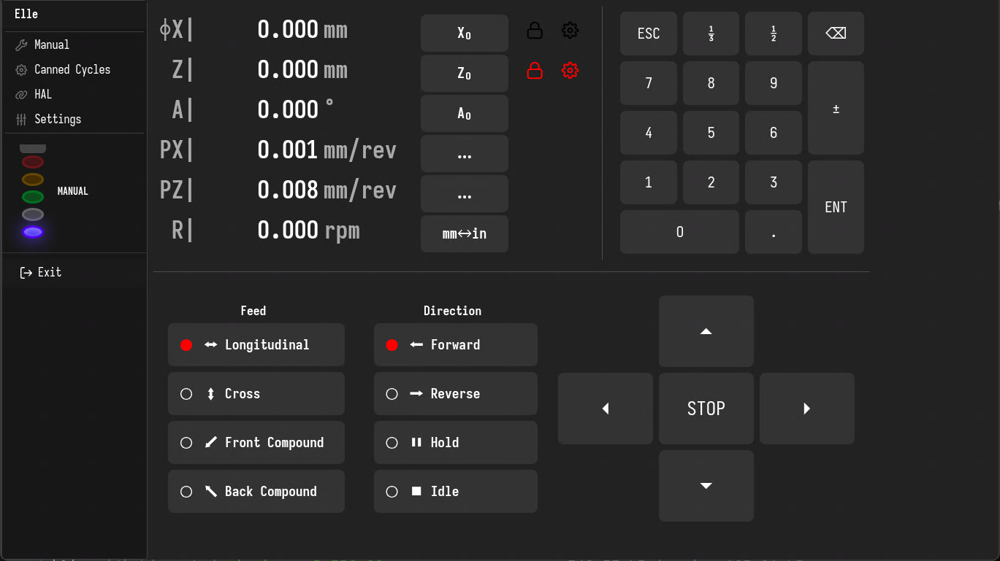
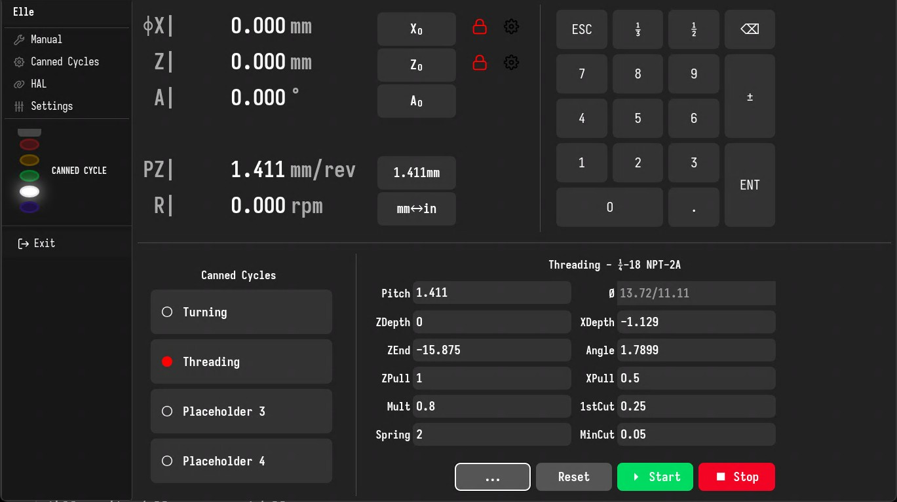
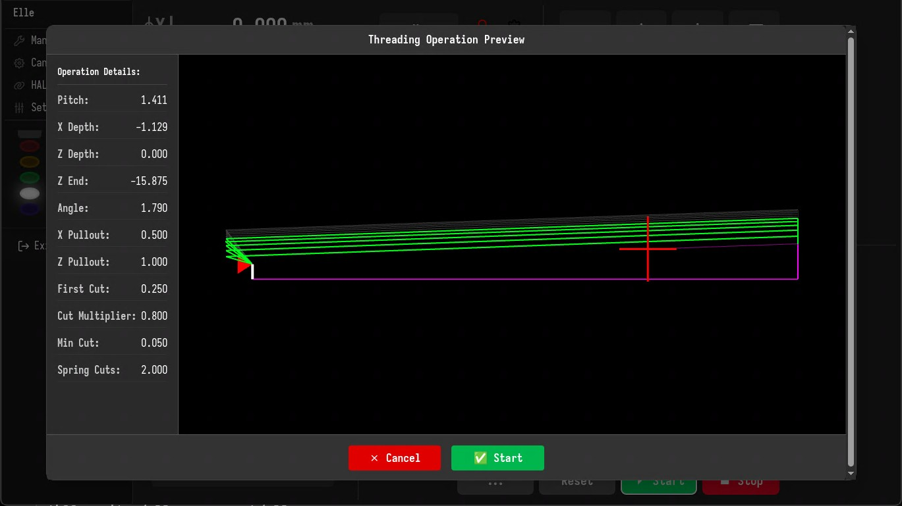
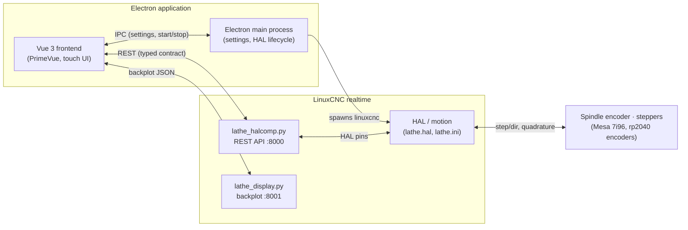

# Elle — Electronic Leadscrew for LinuxCNC

[](https://github.com/tinic/el-linuxcnc-electron/actions/workflows/ci.yml)
[](https://github.com/tinic/el-linuxcnc-electron/releases)
[](LICENSE)

**Elle brings manual control back to CNC-converted lathes.** It is a
standalone electronic leadscrew built on LinuxCNC: a HAL configuration, a
Python REST backend, and a touch-first Vue 3 + Electron interface that
behaves like a classic DRO — while still giving you the canned cycles that
cover most of what a manual lathe is used for.

Many hobbyists convert a manual lathe to CNC but don't want to lose the
feel of manual work. With Elle, LinuxCNC operates like a gearbox with
extras: the spindle encoder drives the Z and X steppers electronically, at
any pitch, in metric or imperial, with threading and turning cycles when
you need them.



## Features

- **Manual mode with electronic gearing** — feed longitudinal, cross, or
  compound at any pitch, synchronized to the spindle encoder.
- **Canned cycles** — threading (including NPT and many common presets)
  and turning/taper cycles, with an animated 3D backplot preview before
  anything moves.
- **Classic DRO behavior** — a single work coordinate system shared
  between manual and cycle modes; set it in manual mode, cycles pick it up.
- **Touch-first UI** — on-screen numpad, no keyboard required; designed
  for 10"+ touch screens.
- **Diameter/radius mode and mm/inch switching on the fly** — every value
  in the interface updates dynamically.
- **Per-axis control modes** — engaged (synchronized to spindle), hold
  (steppers locked), or idle (steppers unpowered).
- **Spindle position readout in degrees** — usable like a rotary table.
- **Tool table** with per-tool X/Z offsets.
- **Connection watchdog** — the UI shows an amber stack-light segment the
  moment the backend stops responding.

| Threading cycle | Thread preview |
| --- | --- |
|  |  |

## Architecture


```mermaid
flowchart LR
    subgraph Electron application
        UI["Vue 3 frontend<br/>(PrimeVue, touch UI)"]
        MAIN["Electron main process<br/>(settings, HAL lifecycle)"]
    end
    subgraph LinuxCNC realtime
        HALCOMP["lathe_halcomp.py<br/>REST API :8000"]
        DISPLAY["lathe_display.py<br/>backplot :8001"]
        HAL["HAL / motion<br/>(lathe.hal, lathe.ini)"]
    end
    HW["Spindle encoder · steppers<br/>(Mesa 7i96, rp2040 encoders)"]

    UI <-- "REST (typed contract)" --> HALCOMP
    UI <-- "backplot JSON" --> DISPLAY
    UI <-- "IPC (settings, start/stop)" --> MAIN
    MAIN -- "spawns linuxcnc" --> HAL
    HALCOMP <-- "HAL pins" --> HAL
    HAL <-- "step/dir, quadrature" --> HW
```

- **Frontend** (`elle-app/elle-frontend/`) — Vue 3 SPA, state in
  composables, 3D previews via three.js. Polls positions at 30 Hz and
  tracks backend health explicitly.
- **Electron main** (`elle-app/elle-electron/`) — window management,
  settings persistence (electron-store), starts/stops LinuxCNC.
- **Backend** (`elle-app/elle-hal/`) — `lathe_halcomp.py` is loaded as a
  HAL userspace component and serves the REST API; pure G-code generation
  lives in `gcode_gen.py`; `lathe_display.py` runs as the LinuxCNC DISPLAY
  program and renders backplots.

### The API contract

Every request/response between the frontend and the Python backend is
defined once, in [`elle-app/elle-hal/api_models.py`](elle-app/elle-hal/api_models.py)
(pydantic). TypeScript types are generated from it:

```sh
cd elle-app/elle-frontend
yarn generate:api   # api_models.py → api-schema.json → src/api/types.gen.ts
```

A pytest guard fails CI if the committed schema drifts from the models, so
the two sides of the API cannot silently disagree.

## Hardware requirements

- A lathe converted to CNC with **step/direction stepper drivers** on X
  and Z. The stepper-enable line must be wired (usually not needed for
  pure CNC operation) so axes can be dropped to idle.
- **Spindle encoder** with quadrature A/B signals.
- A PC running a **LinuxCNC real-time kernel** (PREEMPT_RT), ideally with
  a dedicated isolated CPU core (see `elle-app/rt_setup.sh`).
- Touch screen, 1024×768 minimum (10" or larger recommended).

The reference HAL configuration (`elle-app/elle-hal/lathe.hal`) targets a
**Mesa 7i96** ethernet FPGA card plus an external `rp2040_encoder`
userspace component for the axis DRO encoders. Adapt `lathe.hal` /
`lathe.ini` to your own hardware.

## Installation

On a fresh LinuxCNC 2.8+ machine (Debian-based):

```sh
git clone https://github.com/tinic/el-linuxcnc-electron.git
cd el-linuxcnc-electron
./bootstrap.sh        # installs Node.js, LinuxCNC dev packages, builds the .deb
```

Or grab a prebuilt `.deb` from the
[releases page](https://github.com/tinic/el-linuxcnc-electron/releases).

## Development

```sh
cd elle-app
yarn setup            # install electron + frontend dependencies
yarn start            # vite dev server + electron; starts LinuxCNC when ready
```

Remote development against a running lathe is supported: open the vite dev
server in a browser and the frontend talks to the machine (host `lathev2`)
instead of localhost.

### Tests & checks

```sh
# Python backend (G-code golden tests, API contract guard)
python3 -m venv .venv && .venv/bin/pip install pytest pydantic
.venv/bin/pytest elle-app/elle-hal/tests

# Frontend unit tests
cd elle-app/elle-frontend && yarn test

# Lint + typecheck
cd elle-app && yarn lint && yarn build
cd elle-frontend && yarn build
```

All of the above run in CI on every push and pull request. Releases are
built and published automatically when a `v*` tag is pushed.

## Project layout

```
elle-app/
├── elle-electron/     Electron main process (window, IPC, settings)
├── elle-frontend/     Vue 3 application
│   └── src/
│       ├── api/       Typed REST client + generated contract types
│       ├── components/
│       └── composables/
└── elle-hal/          LinuxCNC side
    ├── lathe.hal      HAL wiring (Mesa 7i96 reference config)
    ├── lathe.ini      LinuxCNC machine configuration
    ├── lathe_halcomp.py   REST API ↔ HAL bridge
    ├── gcode_gen.py   Pure canned-cycle G-code generators
    ├── api_models.py  Single source of truth for the REST contract
    └── tests/         pytest suite incl. golden-file G-code tests
```

## License

[MIT](LICENSE) — © Tinic Uro
