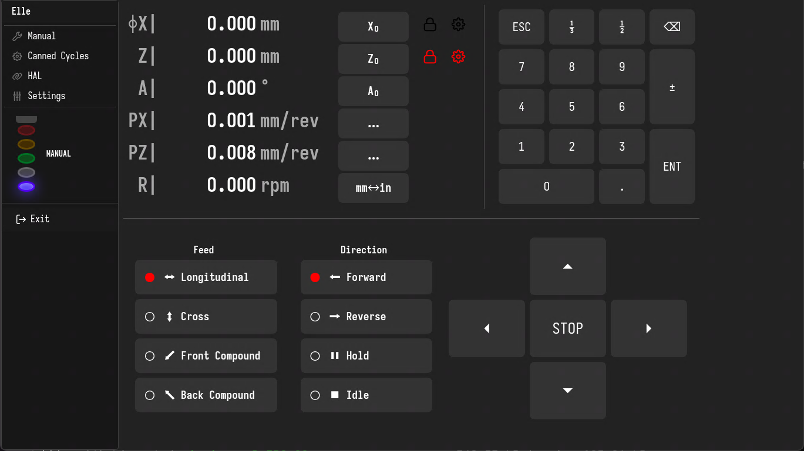
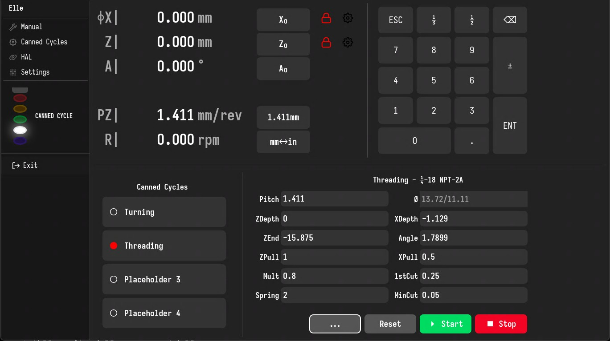

# el-linuxcnc-electron

This is a standalone electronic leadscrew HAL configuration + Electron app based UI for lathes. It essentially brings back manual control to lathes which have been converted to CNC.

Background: Many hobbyists convert their manual lathe to function as a CNC machine but do not want to lose the ability to use the machine in manual mode. This configuration make this possible. LinuxCNC in this case operates like a gearbox with a few additional features.

Please note that for this to function you have to wire up the enable/disable signal on your stepper drivers, which is usually not required for pure CNC operation.

